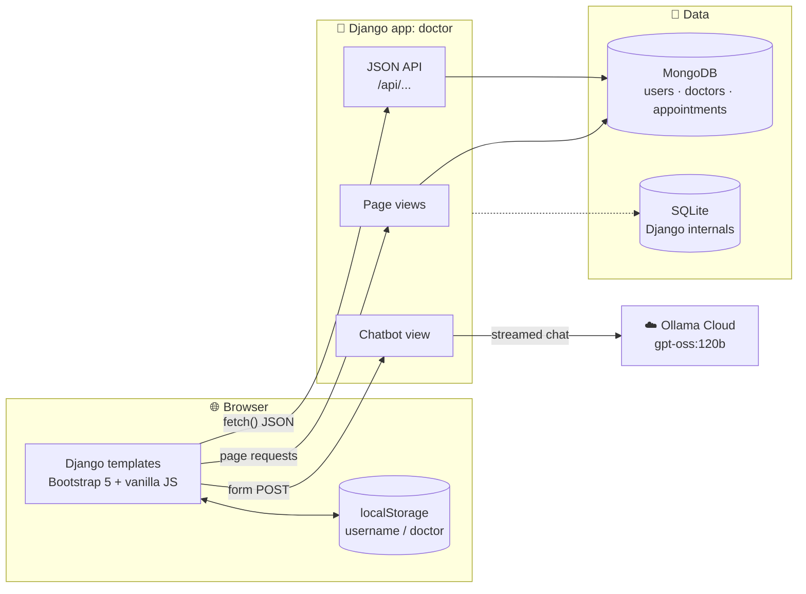

<div align="center">

# 🩺 MyDoc AI

### An AI-powered healthcare portal for finding doctors, booking appointments and getting instant health guidance

Patients can chat with an AI medical assistant, browse specialists and book appointments. Doctors approve or reject their bookings, and admins manage the whole platform, all from one web app.


</div>

---

## 📑 Table of Contents

- [Overview](#-overview)
- [Features](#-features)
- [Architecture](#-architecture)
- [Tech Stack](#-tech-stack)
- [Getting Started](#-getting-started)
- [Usage](#-usage)
- [Pages](#-pages)
- [REST API](#-rest-api)
- [Data Model](#-data-model)
- [Project Structure](#-project-structure)
- [Known Limitations](#-known-limitations)
- [Roadmap](#-roadmap)
- [Author](#-author)

---

## 🔍 Overview

**MyDoc AI** is a full-stack healthcare web application built with **Django** and **MongoDB**. It brings together three things patients usually find in separate places:

1. 🤖 **An AI health assistant** that answers medical questions and describes symptoms in plain language. It is powered by the open-weight `gpt-oss:120b` model on **Ollama Cloud**.
2. 👨‍⚕️ **A doctor directory** with specialists, qualifications, experience and working days.
3. 📅 **Online appointment booking** with a status workflow from *Pending* to *Approved* or *Rejected*.

The app supports three roles, **Patient**, **Doctor** and **Admin**, and each role has its own dashboard.

---

## ✨ Features

### 🧑 Patient
- Register or log in with a username and password (stored as a Django PBKDF2 hash)
- Browse doctors by designation and specialisation
- Book an appointment on any upcoming date (past dates are rejected on both client and server)
- Double booking is prevented: one appointment per doctor per day
- Track the live status of your appointments (Pending, Approved or Rejected) on the patient dashboard

### 👨‍⚕️ Doctor
- Log in from the same page by choosing the **Doctor** role
- See every appointment booked with you
- **Approve** or **reject** requests with one click

### 🛡️ Admin
- Log in with credentials from the environment (`ADMIN_USERNAME` / `ADMIN_PASSWORD`)
- See every doctor with their **total appointment count**, plus all registered users
- Add new doctors to the platform

### 🤖 AI Health Chatbot
- Free-text medical Q&A: *"Describe your symptoms or ask a medical question…"*
- Streams its answer from `gpt-oss:120b` through the official `ollama` Python client
- Uses a system prompt that frames the model as a helpful medical assistant

### 🎨 UI
- Responsive **Bootstrap 5** layout with the Inter font and Font Awesome icons
- Hero carousel, glassmorphism navbar and animated service cards
- Pages: Home, About, Services, Doctors, AI Chatbot, Contact and Login

---

## 🏗 Architecture



- **MongoDB** (through PyMongo) stores all application data: users, doctors and appointments.
- **SQLite** is used only for Django's built-in apps (sessions, admin and auth tables).
- **Ollama Cloud** runs the language model, so no GPU or local model is needed.

---

## 🧰 Tech Stack

| Layer | Technology |
|---|---|
| Backend | Python 3.10+, Django 4.2+ |
| Database | MongoDB via PyMongo (app data), SQLite (Django internals) |
| AI | Ollama Cloud · `gpt-oss:120b` · `ollama` Python client |
| Frontend | Django Templates, Bootstrap 5.3, Font Awesome 6, Vanilla JS (`fetch`) |
| Config | `django-environ` with a `.env` file |
| Security | Django password hashing (PBKDF2) for patient accounts |

---

## 🚀 Getting Started

### Prerequisites

- **Python 3.10+**
- **MongoDB**, either local ([Community Server](https://www.mongodb.com/try/download/community)) or [MongoDB Atlas](https://www.mongodb.com/atlas)
- An **Ollama Cloud API key**, created at [ollama.com/settings/keys](https://ollama.com/settings/keys)

### 1. Clone and install

```bash
git clone https://github.com/mdfaiz04/My-Doc-AI.git
cd My-Doc-AI

python -m venv venv
venv\Scripts\activate            # Windows
# source venv/bin/activate       # macOS / Linux

pip install -r requirements.txt
```

### 2. Configure environment variables

```bash
copy .env.example .env           # Windows
# cp .env.example .env           # macOS / Linux
```

Then open `.env` and fill in your values:

| Variable | Description | Default |
|---|---|---|
| `DJANGO_SECRET_KEY` | Django secret key | dev-only placeholder |
| `DEBUG` | Debug mode | `True` |
| `ALLOWED_HOSTS` | Comma-separated hosts | *(empty)* |
| `MONGO_URI` | MongoDB connection string | `mongodb://localhost:27017` |
| `MONGO_DB_NAME` | Database name | `doctor_app` |
| `ADMIN_USERNAME` / `ADMIN_PASSWORD` | Admin dashboard login | `admin` / `admin123` |
| `OLLAMA_API_KEY` | Ollama Cloud key for the chatbot | *(empty; chatbot disabled)* |

> 🔐 `.env` is git-ignored. Never commit real keys.

### 3. Set up Django and seed doctors

```bash
python manage.py migrate
```

Doctors live in MongoDB. Here is a sample record you can insert with `mongosh`. The images already exist in `static/doctors/`.

```js
use doctor_app
db.doctors.insertOne({
  username: "arjun",
  password: "arjun",                 // doctor login password (default = username)
  name: "Dr. Arjun Mehta",
  designation: "Cardiologist",
  specialization: "Cardiology",
  qualification: "MBBS, MD (Cardiology)",
  experience: "12 years",
  badge: "Top Rated",
  work_days: "Mon-Sat",
  image: "doctors/arjun.jpg"
})
```

### 4. Run

```bash
python manage.py runserver
```

Open **http://127.0.0.1:8000** 🎉

---

## 🎮 Usage

| Role | How to sign in | Where you land |
|---|---|---|
| 🧑 Patient | **Login** → role *User* → Register, then log in | `/user_dashboard/` (book appointments and track their status) |
| 👨‍⚕️ Doctor | **Login** → role *Doctor* → doctor username and password | `/doctor_dashboard/` (approve or reject bookings) |
| 🛡️ Admin | **Login** → role *Admin* → values from `.env` | `/admin_dashboard/` (statistics, doctors and users) |

The **AI chatbot** at `/chatbot/` doesn't require a login.

---

## 🗺 Pages

| Route | Page |
|---|---|
| `/` | Home: hero carousel |
| `/about/` | About us: mission and values |
| `/services/` | Services: AI chatbot, booking, specialists, treatments, emergency care |
| `/doctors/` | Doctor directory |
| `/chatbot/` | AI health assistant |
| `/contact_us/` | Contact form |
| `/login/` | Single login page for all three roles |
| `/user_dashboard/` | Patient dashboard |
| `/doctor_dashboard/` | Doctor dashboard |
| `/admin_dashboard/` | Admin dashboard |

---

## 🔌 REST API

All endpoints accept and return JSON.

| Method | Endpoint | Body / Params | Description |
|---|---|---|---|
| `POST` | `/api/user/login-register/` | `username`, `password`, `register` (bool) | Registers a patient or logs one in |
| `POST` | `/api/doctor/login/` | `username`, `password` | Logs a doctor in |
| `POST` | `/api/admin/login/` | `username`, `password` | Logs the admin in |
| `POST` | `/api/admin/add-doctor/` | `admin_user`, `admin_pass`, `username`, `password`, `name`, `specialization` | Adds a doctor (requires admin credentials) |
| `GET` | `/api/doctors/all/` | — | Lists all doctors (passwords removed) |
| `POST` | `/api/appointment/book/` | `doctor_id` (doctor username), `username`, `day` (`YYYY-MM-DD`) | Books an appointment. Returns `409` if the slot is taken |
| `GET` | `/api/doctor/<doctor_name>/appointments/` | — | Lists a doctor's appointments |
| `POST` | `/api/appointment/update/` | `id`, `action` (`approve` / `reject`) | Updates an appointment's status |

**Example: book an appointment**

```bash
curl -X POST http://127.0.0.1:8000/api/appointment/book/ \
  -H "Content-Type: application/json" \
  -d '{"doctor_id": "arjun", "username": "faiz", "day": "2026-10-01"}'
# → {"msg": "appointment created", "status": "Pending"}
```

---

## 🗄 Data Model

MongoDB database `doctor_app` (configurable):

```text
users          { username, password (hashed), role: "user" }
doctors        { username, password, name, designation, specialization,
                 qualification, experience, badge, work_days, image }
appointments   { doctor (username), user (username), day: "YYYY-MM-DD",
                 status: "Pending" | "Approved" | "Rejected", created_at }
```

---

## 📁 Project Structure

```
My-Doc-AI/
├── manage.py
├── requirements.txt
├── .env.example              # Template for your local .env
├── mydoc/                    # Django project
│   ├── settings.py           # Reads config and secrets from .env
│   ├── urls.py               # Root URLs → doctor.urls
│   ├── db.py                 # MongoDB client and collections
│   ├── asgi.py / wsgi.py
├── doctor/                   # Main app
│   ├── views.py              # Page views, JSON API, AI chatbot
│   ├── urls.py               # Page and API routes
│   └── utilis.py             # JSON helpers
├── templates/                # base.html + 10 page templates
└── static/
    ├── img1.png … img3.png   # Home carousel
    ├── doctors/              # Doctor profile photos
    └── services/             # Service section images
```

---

## ⚠ Known Limitations

This is an academic project. Before any real-world deployment, address the following:

- **Authentication runs on the client.** Dashboards identify the user through `localStorage`, and the JSON APIs are `@csrf_exempt` with no server-side sessions or tokens.
- **Doctor passwords are stored in plain text.** New doctors also get their username as their default password. Patient passwords are properly hashed.
- **Adding a doctor from the admin dashboard** calls `/api/admin/add_doctor/`, but the route is `/api/admin/add-doctor/`. Use the API directly or `mongosh` until this is fixed.
- **The contact form** is front-end only; messages are not saved or sent.
- **The chatbot is not a doctor.** Its answers are informational only and are not a medical diagnosis.

---

## 🔭 Roadmap

- [ ] Server-side sessions or JWT auth, with role-based access control on every API
- [ ] Hash doctor passwords and add a password-reset flow
- [ ] Time slots within a day instead of one booking per doctor per day
- [ ] Email or SMS notifications when an appointment is approved or rejected
- [ ] Chat history and symptom-to-specialist recommendations that link straight to booking
- [ ] Docker Compose setup (Django + MongoDB) and cloud deployment

---

## 👤 Author

**MD Faiz** · [@mdfaiz04](https://github.com/mdfaiz04)

---

<div align="center">

> ⚕️ **Disclaimer:** MyDoc AI is an educational project. The AI assistant does not replace professional medical advice, diagnosis or treatment. In an emergency, contact your local emergency services.

⭐ If you found this project useful, consider giving it a star!

</div>
